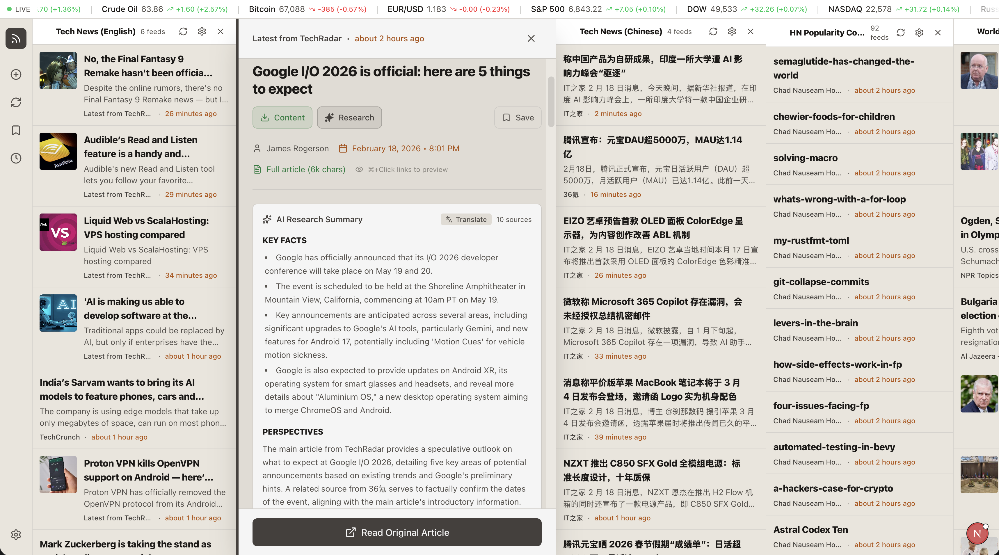

# RSS Deck - AI-Powered News Dashboard

A modern, multi-column RSS reader with local AI integration for summarizing, sentiment analysis, and chatting with articles.

[](https://buymeacoffee.com/kianfongl)
[](https://hub.docker.com/r/kianfong/rssdeck)



## ✨ Features

📰 **Multi-Column Layout** - TweetDeck-style interface for managing multiple RSS feeds side-by-side

🤖 **Local AI Integration** - Powered by Ollama for privacy-first AI features:
  - Instant article summarization
  - Sentiment analysis (🟢 positive, 🔴 negative)
  - Chat with any article

🔒 **Privacy Focused** - Everything runs locally. No cloud APIs, no data collection

📰 **Full-Article Scraping** - Custom scraper with Mozilla's Readability for complete article content

🎨 **Beautiful Themes** - Multiple color schemes including:
  - Cyberpunk Neon
  - Dark Mode
  - Light Mode
  - Sepia (ebook style)

📱 **Responsive Design** - Works on desktop and mobile

## 🚀 Quick Start

### Prerequisites

- Node.js 18+ 
- Docker & Docker Compose (for containerized deployment)
- Ollama (for local AI features)

### Local Development

```bash
# Clone the repository
git clone https://github.com/mephistophelesbits/rssdeck.git
cd rssdeck

# Install dependencies
npm install

# Start development server
npm run dev

# Open http://localhost:3000
```

### Docker Deployment (Pre-built Image)

```bash
# One-line deploy
docker run -d -p 3000:3000 -v rss-data:/app/data --name rssdeck kianfong/rssdeck:latest

# Or with docker-compose
docker-compose up -d

# Access at http://localhost:3000
```

### Docker Deployment (Build Locally)

```bash
# Clone and build locally
git clone https://github.com/mephistophelesbits/rssdeck.git
cd rssdeck
docker-compose up -d --build

# Access at http://localhost:3000
```

### Ollama Setup

```bash
# Install Ollama
# Download from https://ollama.ai

# Pull a model (recommended: llama3.2 or mistral)
ollama pull llama3.2

# RSS Deck will automatically connect to Ollama at http://localhost:11434
```

## 📁 Project Structure

```
rss-deck/
├── app/
│   ├── api/              # API routes (RSS, AI, scraping)
│   ├── bookmarks/        # Bookmarks page
│   ├── page.tsx          # Main dashboard
│   └── layout.tsx        # App layout
├── components/
│   ├── deck/             # Deck column components
│   ├── ui/               # UI components
│   ├── BriefingManager.tsx
│   └── ThemeProvider.tsx
├── lib/
│   ├── ai/               # AI provider implementations
│   ├── rss/              # RSS parsing utilities
│   └── settings-store.ts # State management
├── public/               # Static assets
├── Dockerfile
├── docker-compose.yml
└── package.json
```

## 🎯 Use Cases

- **Morning Briefing** - Get an AI-summarized overview of your morning news
- **Topic Research** - Chat with articles to dive deeper into complex topics
- **Sentiment Tracking** - Visual indicators help you gauge overall news mood
- **Full-Content Reading** - No more frustrating paywalls or ad-heavy sites

## 🛠️ Tech Stack

- **Framework**: Next.js 15 with TypeScript
- **Styling**: Tailwind CSS
- **State**: Zustand
- **AI**: Ollama (local LLM)
- **RSS**: Custom parser + Mozilla Readability
- **Deployment**: Docker

## 📋 Changelog

### v1.1.0 (Feb 2026)
- **OPML Import** - Bulk import feeds from Feedly, Inoreader, Google Reader
- **Summary Caching** - Stable article IDs prevent re-summarizing
- **Notification Rate Limiting** - 1-hour cooldown per article
- **Telegram Briefings** - Daily AI-curated news delivered to Telegram
- **Landing Page** - Product page at `/landing`
- **Stock Ticker** - Real-time portfolio with AI trading signals
- **8 Themes** - Including J.A.R.V.I.S., Matrix, Cyberpunk

## 📝 The Story Behind RSS Deck

I built RSS Deck because I missed the command-center feeling of TweetDeck, but wanted modern features:
- Full article content (not just snippets)
- Local AI for summarization and chat
- Beautiful, distraction-free reading

As someone who "can't code," I built this entirely through "vibe coding" with AI tools. If I can build this, imagine what you could create too.

[Read the full story →](vibe_coding_journey.md)

## 🤝 Contributing

Contributions are welcome! Whether you want to:
- Add new features
- Fix bugs
- Improve documentation
- Suggest themes

Open an issue or submit a PR!

## 📄 License

MIT License - feel free to use, modify, and share.

## 🙏 Acknowledgments

- [Next.js](https://nextjs.org/) - The React framework
- [Ollama](https://ollama.ai/) - Local AI made simple
- [Mozilla Readability](https://github.com/mozilla/readability) - Article parsing
- [Tailwind CSS](https://tailwindcss.com/) - Utility-first CSS

---

**Built with 💻 and 🤖 by Wong Kian Fong**

If this project inspires you, [give it a ⭐ on GitHub](https://github.com/mephistophelesbits/rssdeck)!

☕ **[Buy me a coffee](https://buymeacoffee.com/kianfongl)** — Support vibe coding and open source tools
# Trigger build
