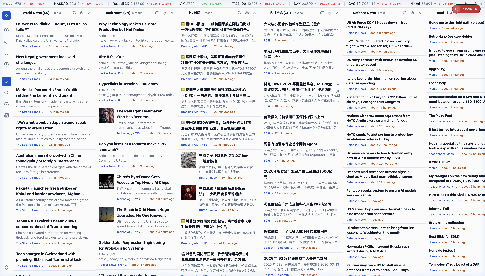

# IntelliDeck — The AI-First RSS Reader

[](https://buymeacoffee.com/kianfongl)
[](https://hub.docker.com/r/kianfong/intellideck)



---

Remember TweetDeck? That feeling of having everything in view — your feeds laid out in columns, nothing hidden, nothing buried? IntelliDeck brings that back. Except now there's an AI sitting alongside you, reading with you, summarizing for you, and alerting you to exactly what matters.

This is not a reader with AI bolted on. The AI is the point.

---

## 🤖 Chat & Summarize with Local AI

Powered by [Ollama](https://ollama.ai) — your AI runs entirely on your own machine. No cloud APIs, no data leaving your network, no subscriptions.

Click any article to get an instant summary, or open a chat to go deeper. Ask it to explain context, find connections, or cut through the noise. It's like having a research assistant who has read everything in your feeds.

## 🔔 Keyword Alerts

Define the topics that matter to you — company names, technologies, people, anything. IntelliDeck highlights matching articles across all your feeds in real time, so important stories never slip past even when you're not actively watching.

## ☀️ Morning Briefing

Every morning, your AI acts as a News Intelligence Officer — reading across all your feeds, selecting the strategic headlines, and writing you a concise briefing. Delivered to Telegram, no app switching required.

## 📖 Inline Reading, Full Content

Click an article and it opens as a dedicated column right next to the feed — without covering anything else. Full article text via Mozilla Readability, no paywalls, no ad-heavy pages, no new tabs.

---

## 🚀 Quick Start

### Docker (recommended)

```bash
docker run -d -p 3000:3000 -v rss-data:/app/data --name intellideck kianfong/intellideck:latest
```

> **Mac Apple Silicon users:** Build locally for native performance (see below).

### Docker Compose

```bash
git clone https://github.com/mephistophelesbits/intellideck.git
cd intellideck
docker-compose up -d
```

Access at `http://localhost:3000`

### Local Development

```bash
git clone https://github.com/mephistophelesbits/intellideck.git
cd intellideck
npm install
npm run dev
```

### Ollama Setup

```bash
# Install from https://ollama.ai, then pull a model
ollama pull llama3.2

# IntelliDeck auto-connects to Ollama at http://localhost:11434
```

---

## The Story

I built IntelliDeck because I missed TweetDeck and wanted something modern — full article content, local AI, beautiful themes. The twist: I can't code. I built the entire thing through vibe coding with AI tools.

IntelliDeck is a project built with AI, powered by AI, for people who want to read with AI. That's not a coincidence.

[Read the full story →](vibe_coding_journey.md)

---

## Full Feature List

- **Multi-column deck layout** — add, reorder, and resize columns freely
- **Feed Lists** — organize feeds into named lists, switch between views
- **OPML Import** — bulk import from Feedly, Inoreader, Google Reader
- **Similar Articles** — client-side text similarity surfaces related stories while you read
- **Telegram Briefings** — daily AI-curated news delivered to your phone
- **Custom AI Prompts** — configure your own summarization and briefing instructions
- **Multiple AI Providers** — Ollama, OpenAI, Anthropic, Gemini, DeepSeek — per-provider API keys
- **Two Themes** — "Reader Studio" (dark) and "Feed Dashboard" (light), with glassmorphism UI
- **Responsive** — works on desktop and mobile
- **Bookmarks** — save articles for later

---

## Tech Stack

- **Framework**: Next.js 15 + TypeScript
- **Styling**: Tailwind CSS
- **State**: Zustand
- **AI**: Ollama (local) + OpenAI / Anthropic / Gemini / DeepSeek
- **RSS**: Custom parser + Mozilla Readability
- **Deployment**: Docker

---

## 🦞 IntelliDeck-MCP — For AI Agents

Need to feed your AI agent a stream of curated news? **[IntelliDeck-MCP](https://github.com/mephistophelesbits/intellideck-mcp)** is a companion MCP server that wraps your RSS feeds in a token-efficient, agent-friendly format.

- TL;DR summaries — not full articles
- Relevance scoring and deduplication
- Perfect for OpenClaw and other AI agents

```
IntelliDeck (Web UI) → Export OPML → IntelliDeck-MCP → AI Agent
```

[Learn more →](https://github.com/mephistophelesbits/intellideck-mcp)

---

## Changelog

### v2.0.0 (March 2026)
- Top navigation bar replacing side rail — cleaner, unified across all views
- Stitch design system — deep contrasts for dark mode, vivid `#1152d4` accents for light
- Glassmorphism components — transparent, backdrop-blurred cards and panels
- Feed Lists — organize feeds into named lists with auto-migration from existing columns

### v1.4.0 (Feb 2026)
- Similar Posts — zero-API client-side text similarity engine
- Custom AI Prompts — configurable summarization and briefing instructions
- Keyword Alerts — highlight articles matching your defined topics

### v1.3.0 (Feb 2026)
- Multi-provider AI settings — separate keys for OpenAI, Anthropic, Gemini, DeepSeek
- Morning Briefing — AI News Intelligence Officer mode
- Telegram HTML formatting and bot management UI

[Full changelog →](#)

---

## Contributing

Contributions welcome — features, bugs, docs, themes. Open an issue or submit a PR.

## License

MIT — use it, fork it, ship it.

## Acknowledgments

[Next.js](https://nextjs.org/) · [Ollama](https://ollama.ai/) · [Mozilla Readability](https://github.com/mozilla/readability) · [Tailwind CSS](https://tailwindcss.com/)

---

**Built with AI, by [Wong Kian Fong](https://buymeacoffee.com/kianfongl)**

If this project is useful to you, [give it a star](https://github.com/mephistophelesbits/intellideck) or [buy me a coffee](https://buymeacoffee.com/kianfongl).
